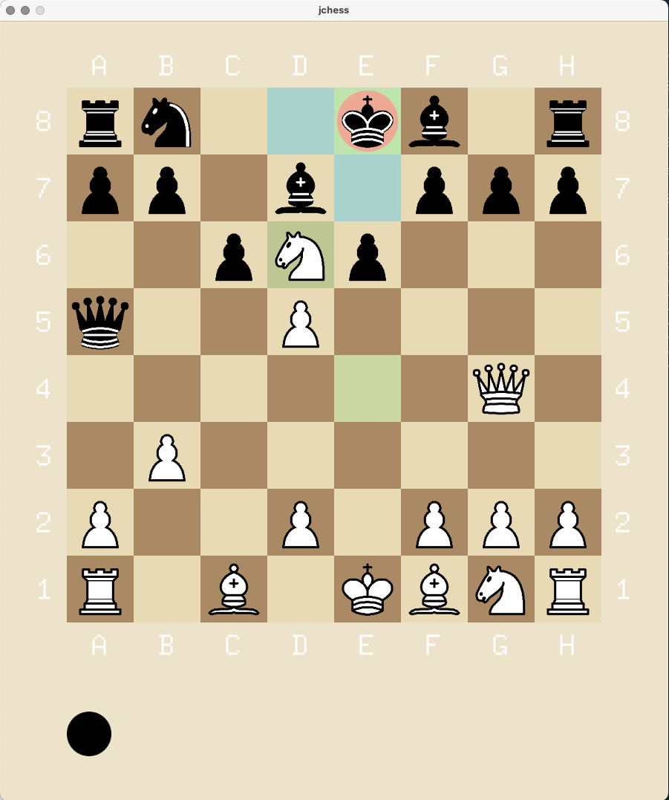

# jchess
Simple chess implementation written in go with a gui powered by ebitengine.



## Usage

**Go Environment**

To run jchess, you need a working Go installation.
The project was developed with `go1.24.2` under `arm64`.

To confirm your installation run:
```
go run github.com/hajimehoshi/ebiten/v2/examples/rotate@latest
```

**Just**

`just` is our command runner of choice. To install using `cargo` run
```sh
cargo install just
```


To run jchess then run:
```sh
just
```

Alternatively without `just`, run:
```sh
go run .
```
